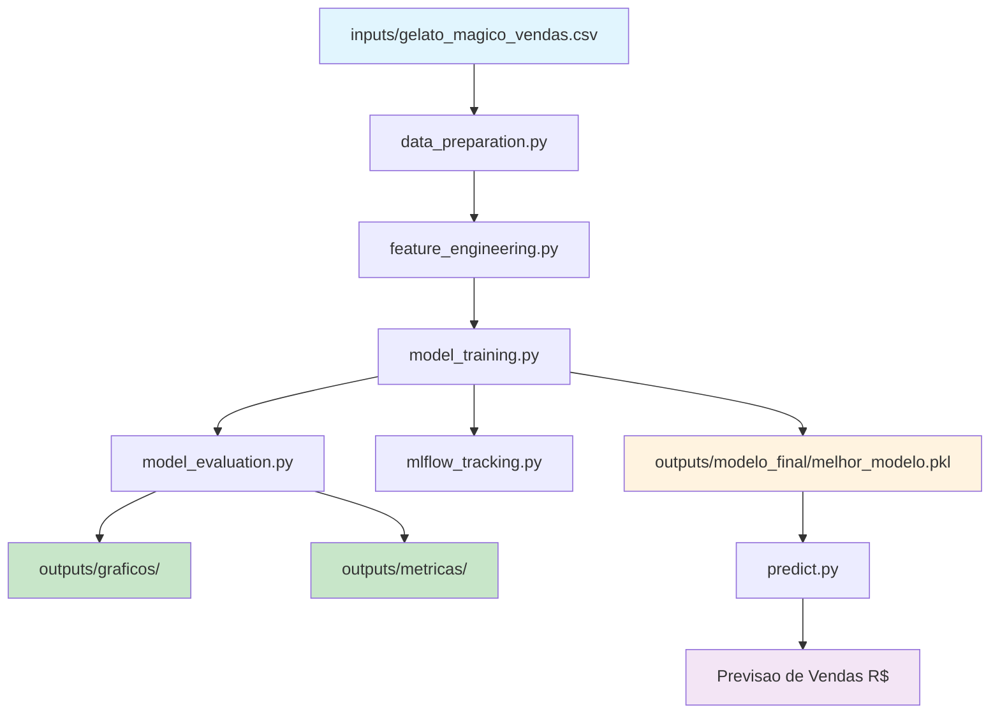
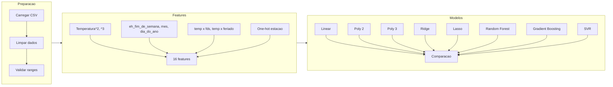
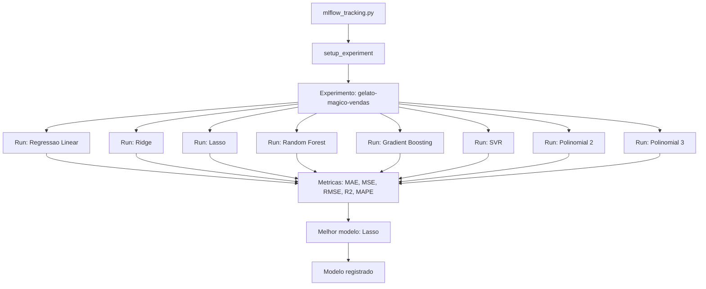
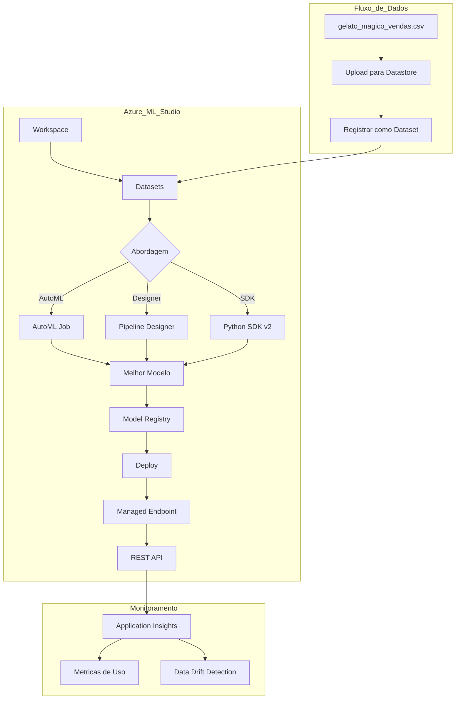

# Gelato Magico - Previsao de Vendas com Machine Learning

[](https://python.org)
[](https://scikit-learn.org)
[](https://mlflow.org)
[](LICENSE)

Projeto de Machine Learning para prever as vendas diarias de uma sorveteria ficticia ("Gelato Magico") com base na temperatura e outros fatores como dia da semana, feriados e estacao do ano. Desenvolvido como projeto do bootcamp **Microsoft Certification Challenge #5 - DP-100** da [DIO](https://www.dio.me/).

O projeto compara 8 modelos de regressao, utiliza MLflow para rastreamento de experimentos e documenta como o fluxo seria implementado no Azure Machine Learning.

---

## Indice

- [Contexto do Problema](#contexto-do-problema)
- [Dados Utilizados](#dados-utilizados)
- [Arquitetura do Projeto](#arquitetura-do-projeto)
- [Engenharia de Features](#engenharia-de-features)
- [Modelos Treinados e Resultados](#modelos-treinados-e-resultados)
- [Analise Exploratoria](#analise-exploratoria)
- [MLflow - Rastreamento de Experimentos](#mlflow---rastreamento-de-experimentos)
- [Fluxo Teorico no Azure ML](#fluxo-teorico-no-azure-ml)
- [Como Executar](#como-executar)
- [Estrutura do Projeto](#estrutura-do-projeto)
- [Possibilidades de Melhoria](#possibilidades-de-melhoria)
- [Referencias](#referencias)
- [Licenca](#licenca)

---

## Contexto do Problema

A sorveteria ficticia "Gelato Magico", localizada em Sao Paulo, deseja prever suas vendas diarias para otimizar a producao, reduzir desperdicio e planejar compras de insumos. A intuicao de que "dias quentes vendem mais sorvete" e comprovada pelos dados, mas o objetivo e quantificar essa relacao e incorporar outros fatores relevantes.

**Pergunta central:** Dado um dia com temperatura X, sendo dia da semana Y, feriado ou nao, em determinada estacao, quanto a loja deve esperar vender?

---

## Dados Utilizados

### Dataset Base (Kaggle)

O dataset de referencia e o [Temperature and Ice Cream Sales](https://www.kaggle.com/datasets/raphaelmanayon/temperature-and-ice-cream-sales) de Raphael Manayon (licenca MIT), contendo ~500 registros de temperatura (C) vs receita de sorvete (USD). Esse dataset fornece a relacao fundamental entre temperatura e vendas com correlacao de ~0.98.

### Dataset Sintetico (Gelato Magico)

A partir do padrao observado no dataset base, foi gerado um dataset sintetico de **365 registros** simulando um ano completo (2025) para a Gelato Magico em Sao Paulo:

| Coluna | Tipo | Descricao |
|--------|------|-----------|
| `data` | date | Data (2025-01-01 a 2025-12-31) |
| `temperatura` | float | Temperatura em Celsius (11.2 - 33.4 C) |
| `dia_da_semana` | int | 0=Segunda a 6=Domingo |
| `eh_feriado` | int | 1 se feriado nacional, 0 caso contrario |
| `estacao` | str | verao, outono, inverno, primavera (hemisferio sul) |
| `vendas` | float | Vendas em R$ (183.81 - 650.24) |

O modelo de temperatura segue um padrao cosenoidal realista para Sao Paulo (media 22.5 C, amplitude sazonal de 5.5 C). As vendas sao influenciadas por:
- **Temperatura** (efeito dominante, ~89% da correlacao)
- **Fim de semana** (bonus de ~15%)
- **Feriado** (bonus de ~20%)
- **Estacao** (bonus sazonal variavel)
- **Ruido gaussiano** (~8%)

---

## Arquitetura do Projeto



### Pipeline de Dados



---

## Engenharia de Features

A partir das 5 colunas originais, o pipeline de engenharia de features gera **16 features** para os modelos:

| # | Feature | Origem | Justificativa |
|---|---------|--------|---------------|
| 1 | `temperatura` | original | Preditor principal |
| 2 | `dia_da_semana` | original | Padrao de consumo semanal |
| 3 | `eh_feriado` | original | Efeito de feriado nas vendas |
| 4 | `temperatura_quadrada` | temperatura^2 | Capturar nao-linearidade |
| 5 | `temperatura_cubica` | temperatura^3 | Capturar saturacao em extremos |
| 6 | `temperatura_normalizada` | z-score | Padronizacao para SVR |
| 7 | `eh_fim_de_semana` | dia_da_semana >= 5 | Efeito de final de semana |
| 8 | `mes` | data.month | Sazonalidade mensal |
| 9 | `dia_do_ano` | data.dayofyear | Posicao no ano |
| 10 | `semana_do_ano` | data.isocalendar | Agrupamento semanal |
| 11 | `temperatura_x_fds` | temp * eh_fim_de_semana | Interacao temp-fds |
| 12 | `temperatura_x_feriado` | temp * eh_feriado | Interacao temp-feriado |
| 13 | `estacao_inverno` | one-hot | Indicador de inverno |
| 14 | `estacao_outono` | one-hot | Indicador de outono |
| 15 | `estacao_primavera` | one-hot | Indicador de primavera |
| 16 | `estacao_verao` | one-hot | Indicador de verao |

---

## Modelos Treinados e Resultados

Foram treinados e avaliados **8 modelos de regressao** com divisao treino/teste de 80/20:

| Rank | Modelo | MAE (R$) | RMSE (R$) | R² | MAPE |
|------|--------|----------|-----------|-----|------|
| 1 | **Lasso** | **23.53** | **31.02** | **0.888** | **5.56%** |
| 2 | Ridge | 23.85 | 31.26 | 0.886 | 5.61% |
| 3 | Regressao Linear | 24.69 | 32.47 | 0.877 | 5.82% |
| 4 | SVR | 27.74 | 36.08 | 0.848 | 6.51% |
| 5 | Gradient Boosting | 28.89 | 38.30 | 0.829 | 6.78% |
| 6 | Random Forest | 29.12 | 38.84 | 0.824 | 6.84% |
| 7 | Polinomial Grau 2 | 41.73 | 67.63 | 0.466 | 9.34% |
| 8 | Polinomial Grau 3 | 57.48 | 111.39 | -0.448 | 12.79% |

### Interpretacao dos Resultados

- **Lasso** foi o melhor modelo com MAE de R$23.53 e R² de 0.888, significando que o erro medio de previsao e de cerca de R$23 por dia e o modelo explica 88.8% da variancia das vendas.
- **Modelos lineares regularizados** (Lasso, Ridge) superaram os ensemble methods (Random Forest, Gradient Boosting), o que e esperado dado o tamanho moderado do dataset (365 registros) e a relacao predominantemente linear entre temperatura e vendas.
- **Polinomial Grau 3** apresentou R² negativo, indicando overfitting severo — o modelo se ajustou ao ruido dos dados de treino e nao generaliza.
- **MAPE de 5.56%** do melhor modelo indica que, em media, a previsao erra em 5.56% do valor real, o que e considerado bom para previsao de vendas no varejo.

### Graficos de Avaliacao

O projeto gera automaticamente 35 graficos de avaliacao, incluindo:

- **Comparacao de MAE entre modelos** (`comparacao_modelos.png`)
- **Predicoes vs valores reais** para cada modelo
- **Analise de residuos** (distribuicao e padrao)
- **Importancia de features** (Random Forest e Gradient Boosting)
- **Curvas de aprendizado** para cada modelo
- **Box plots de validacao cruzada**

---

## Analise Exploratoria

A analise exploratoria dos dados revela:

- **Correlacao forte** (0.89) entre temperatura e vendas — a cada 1 C de aumento, vendas sobem ~R$15
- **Efeito de fim de semana**: vendas ~15% maiores aos sabados e domingos
- **Efeito de feriado**: vendas ~20% maiores em feriados nacionais
- **Sazonalidade clara**: verao (media ~R$490) vs inverno (media ~R$310)
- **Distribuicao de temperatura**: media 22.4 C, desvio padrao 4.6 C (padrao realista para Sao Paulo)

Os 6 graficos de EDA sao gerados automaticamente em `outputs/graficos/`:
- Distribuicao de temperatura e vendas (histogramas)
- Scatter plot temperatura vs vendas
- Heatmap de correlacao
- Vendas por dia da semana (barplot)
- Vendas por estacao (boxplot)

---

## MLflow - Rastreamento de Experimentos

O projeto integra o **MLflow** para rastreamento completo dos experimentos:



Para cada modelo, o MLflow registra:
- **Parametros**: hiperparametros do modelo (alpha, n_estimators, kernel, etc.)
- **Metricas**: MAE, MSE, RMSE, R², MAPE
- **Artefatos**: modelo serializado via `mlflow.sklearn`

Para visualizar os experimentos localmente:
```bash
mlflow ui --backend-store-uri file:./mlruns
```

---

## Fluxo Teorico no Azure ML

Embora este projeto tenha sido executado localmente, abaixo esta documentado como o fluxo seria implementado no **Azure Machine Learning Studio**, conforme os conceitos do DP-100:



### Etapas no Azure ML:

1. **Workspace**: Criar um workspace no Azure ML para organizar todos os recursos
2. **Datastore/Dataset**: Fazer upload do CSV para um Azure Blob Storage e registrar como dataset tabulado
3. **Compute**: Criar um compute cluster (ex: Standard_DS3_v2) para treinamento
4. **AutoML**: Configurar um job de AutoML para regressao, com a coluna `vendas` como target
5. **Designer**: Alternativamente, criar um pipeline visual arrastando componentes (normalizar, dividir, treinar, avaliar)
6. **Treinamento via SDK**: Submeter o script `model_training.py` como um Command Job usando o Python SDK v2
7. **Model Registry**: Registrar o melhor modelo no Model Registry do workspace
8. **Deploy**: Criar um Managed Online Endpoint com o modelo registrado
9. **Inferencia**: Chamar o endpoint via REST API passando temperatura, dia_da_semana, etc.
10. **Monitoramento**: Configurar Application Insights para monitorar latencia, erros e data drift

---

## Como Executar

### Pre-requisitos

- Python 3.10+
- pip

### Instalacao

```bash
git clone https://github.com/galafis/ml-sales-prediction-azure.git
cd ml-sales-prediction-azure
pip install -r requirements.txt
```

### Execucao Passo a Passo

```bash
# 1. Gerar os datasets
python -m src.generate_dataset

# 2. Analise exploratoria e graficos de EDA
python -m src.data_preparation

# 3. Engenharia de features
python -m src.feature_engineering

# 4. Treinar todos os modelos e salvar o melhor
python -m src.model_training

# 5. Gerar graficos de avaliacao completos
python -m src.model_evaluation

# 6. Rastreamento MLflow (opcional)
python -m src.mlflow_tracking

# 7. Fazer previsao para um dia especifico
python -m src.predict --temperatura 30 --dia_da_semana 6 --feriado --estacao verao
```

### Exemplo de Previsao

```
$ python -m src.predict --temperatura 30 --dia_da_semana 6 --feriado --estacao verao

  Condicoes informadas:
    Temperatura:    30.0 C
    Dia da semana:  Domingo
    Feriado:        Sim
    Estacao:        Verao

  Vendas previstas: R$ 708.32
```

---

## Estrutura do Projeto

```
ml-sales-prediction-azure/
├── inputs/
│   ├── ice_cream_sales_original.csv    # Dataset base (~500 registros)
│   ├── gelato_magico_vendas.csv        # Dataset sintetico (365 registros)
│   └── descricao_dados.txt            # Descricao dos dados em portugues
├── outputs/
│   ├── graficos/                      # 35 graficos PNG de analise e avaliacao
│   ├── metricas/
│   │   ├── resultados_modelos.csv     # Tabela comparativa dos 8 modelos
│   │   ├── comparacao_modelos.csv     # Metricas detalhadas
│   │   └── features_processadas.csv   # Features apos engenharia
│   └── modelo_final/
│       └── melhor_modelo.pkl          # Modelo Lasso serializado
├── src/
│   ├── __init__.py
│   ├── generate_dataset.py            # Geracao dos datasets
│   ├── data_preparation.py            # Carga, limpeza, EDA
│   ├── feature_engineering.py         # 16 features derivadas
│   ├── model_training.py              # Treinamento de 8 modelos
│   ├── model_evaluation.py            # Avaliacao e visualizacoes
│   ├── pipeline.py                    # Pipeline sklearn end-to-end
│   ├── predict.py                     # Inferencia via CLI
│   └── mlflow_tracking.py            # Integracao MLflow
├── notebooks/
│   └── exploratory_analysis.ipynb     # Notebook de analise exploratoria
├── requirements.txt
├── .gitignore
├── LICENSE
└── README.md
```

---

## Possibilidades de Melhoria

1. **Dados reais**: Substituir o dataset sintetico por dados reais de vendas de uma sorveteria, com mais variaveis (promocoes, eventos locais, concorrencia)
2. **Mais features**: Incorporar dados meteorologicos completos (umidade, precipitacao, indice UV), dados de localizacao, calendarios de eventos
3. **Modelos avancados**: Testar XGBoost, LightGBM, redes neurais (MLP), modelos de series temporais (Prophet, ARIMA)
4. **Otimizacao de hiperparametros**: Implementar GridSearchCV ou Optuna para tuning sistematico
5. **Deploy real no Azure**: Implementar o fluxo completo no Azure ML com endpoint real, monitoramento e CI/CD
6. **Feature Store**: Centralizar as features em um feature store para reutilizacao
7. **Dados temporais**: Tratar o problema como serie temporal com lags, medias moveis e decomposicao sazonal
8. **A/B Testing**: Implementar framework de testes para comparar estrategias de precificacao baseadas nas previsoes

---

## Referencias

- **Dataset original**: [Temperature and Ice Cream Sales](https://www.kaggle.com/datasets/raphaelmanayon/temperature-and-ice-cream-sales) - Raphael Manayon (MIT License)
- **Bootcamp**: [Microsoft Certification Challenge #5 - DP-100](https://www.dio.me/) - DIO
- **scikit-learn**: [Documentacao oficial](https://scikit-learn.org/stable/)
- **MLflow**: [Documentacao oficial](https://mlflow.org/docs/latest/index.html)
- **Azure ML**: [Documentacao do Azure Machine Learning](https://learn.microsoft.com/azure/machine-learning/)
- **DP-100**: [Exame DP-100: Designing and Implementing a Data Science Solution on Azure](https://learn.microsoft.com/credentials/certifications/azure-data-scientist/)

---

## Licenca

Este projeto esta licenciado sob a [Licenca MIT](LICENSE).

---

---

# Gelato Magico - Sales Prediction with Machine Learning

[](https://python.org)
[](https://scikit-learn.org)
[](https://mlflow.org)
[](LICENSE)

Machine Learning project to predict daily sales for a fictional ice cream shop ("Gelato Magico") based on temperature and other factors such as day of the week, holidays, and season. Developed as a project for the **Microsoft Certification Challenge #5 - DP-100** bootcamp by [DIO](https://www.dio.me/).

The project compares 8 regression models, uses MLflow for experiment tracking, and documents how the workflow would be implemented in Azure Machine Learning.

---

## Table of Contents

- [Problem Context](#problem-context)
- [Data Used](#data-used)
- [Project Architecture](#project-architecture)
- [Feature Engineering](#feature-engineering-1)
- [Trained Models and Results](#trained-models-and-results)
- [Exploratory Analysis](#exploratory-analysis)
- [MLflow - Experiment Tracking](#mlflow---experiment-tracking)
- [Theoretical Azure ML Flow](#theoretical-azure-ml-flow)
- [How to Run](#how-to-run)
- [Project Structure](#project-structure)
- [Improvement Possibilities](#improvement-possibilities)
- [References](#references-1)
- [License](#license-1)

---

## Problem Context

The fictional ice cream shop "Gelato Magico", located in Sao Paulo, wants to predict its daily sales to optimize production, reduce waste, and plan ingredient purchases. The intuition that "hot days sell more ice cream" is confirmed by the data, but the goal is to quantify this relationship and incorporate other relevant factors.

**Central question:** Given a day with temperature X, being weekday Y, holiday or not, in a given season, how much should the shop expect to sell?

---

## Data Used

### Base Dataset (Kaggle)

The reference dataset is [Temperature and Ice Cream Sales](https://www.kaggle.com/datasets/raphaelmanayon/temperature-and-ice-cream-sales) by Raphael Manayon (MIT license), containing ~500 records of temperature (C) vs ice cream revenue (USD). This dataset provides the fundamental relationship between temperature and sales with a correlation of ~0.98.

### Synthetic Dataset (Gelato Magico)

From the pattern observed in the base dataset, a synthetic dataset of **365 records** was generated simulating a full year (2025) for Gelato Magico in Sao Paulo:

| Column | Type | Description |
|--------|------|-------------|
| `data` | date | Date (2025-01-01 to 2025-12-31) |
| `temperatura` | float | Temperature in Celsius (11.2 - 33.4 C) |
| `dia_da_semana` | int | 0=Monday to 6=Sunday |
| `eh_feriado` | int | 1 if national holiday, 0 otherwise |
| `estacao` | str | verao, outono, inverno, primavera (Southern hemisphere) |
| `vendas` | float | Sales in R$ (183.81 - 650.24) |

The temperature model follows a realistic cosinusoidal pattern for Sao Paulo (mean 22.5 C, seasonal amplitude of 5.5 C). Sales are influenced by:
- **Temperature** (dominant effect, ~89% of correlation)
- **Weekend** (bonus of ~15%)
- **Holiday** (bonus of ~20%)
- **Season** (variable seasonal bonus)
- **Gaussian noise** (~8%)

---

## Project Architecture

The project follows a modular pipeline architecture:

1. **Data Generation** (`generate_dataset.py`): Creates both datasets with reproducible random seed
2. **Data Preparation** (`data_preparation.py`): Loads, validates, cleans, and generates EDA charts
3. **Feature Engineering** (`feature_engineering.py`): Transforms 5 columns into 16 features
4. **Model Training** (`model_training.py`): Trains and compares 8 regression models
5. **Model Evaluation** (`model_evaluation.py`): Generates 35 evaluation charts and metrics CSVs
6. **MLflow Tracking** (`mlflow_tracking.py`): Logs all experiments with parameters, metrics, and artifacts
7. **Prediction** (`predict.py`): CLI tool for inference with the best model

---

## Feature Engineering

From the 5 original columns, the feature engineering pipeline generates **16 features**:

- **Temperature features**: squared, cubed, normalized (z-score)
- **Temporal features**: is_weekend, month, day_of_year, week_of_year
- **Interaction features**: temperature x weekend, temperature x holiday
- **Categorical encoding**: one-hot encoding of season (4 dummies)

---

## Trained Models and Results

8 regression models were trained and evaluated with an 80/20 train/test split:

| Rank | Model | MAE (R$) | RMSE (R$) | R² | MAPE |
|------|-------|----------|-----------|-----|------|
| 1 | **Lasso** | **23.53** | **31.02** | **0.888** | **5.56%** |
| 2 | Ridge | 23.85 | 31.26 | 0.886 | 5.61% |
| 3 | Linear Regression | 24.69 | 32.47 | 0.877 | 5.82% |
| 4 | SVR | 27.74 | 36.08 | 0.848 | 6.51% |
| 5 | Gradient Boosting | 28.89 | 38.30 | 0.829 | 6.78% |
| 6 | Random Forest | 29.12 | 38.84 | 0.824 | 6.84% |
| 7 | Polynomial Degree 2 | 41.73 | 67.63 | 0.466 | 9.34% |
| 8 | Polynomial Degree 3 | 57.48 | 111.39 | -0.448 | 12.79% |

### Results Interpretation

- **Lasso** was the best model with MAE of R$23.53 and R² of 0.888, meaning the average prediction error is about R$23 per day and the model explains 88.8% of sales variance.
- **Regularized linear models** (Lasso, Ridge) outperformed ensemble methods (Random Forest, Gradient Boosting), which is expected given the moderate dataset size (365 records) and the predominantly linear relationship between temperature and sales.
- **Polynomial Degree 3** showed negative R², indicating severe overfitting.
- **MAPE of 5.56%** for the best model indicates that, on average, the prediction is off by 5.56% from the actual value, which is considered good for retail sales forecasting.

---

## Exploratory Analysis

Key findings from the exploratory data analysis:

- **Strong correlation** (0.89) between temperature and sales — each 1 C increase raises sales by ~R$15
- **Weekend effect**: sales ~15% higher on Saturdays and Sundays
- **Holiday effect**: sales ~20% higher on national holidays
- **Clear seasonality**: summer (avg ~R$490) vs winter (avg ~R$310)
- **Temperature distribution**: mean 22.4 C, std 4.6 C (realistic pattern for Sao Paulo)

---

## MLflow - Experiment Tracking

The project integrates **MLflow** for full experiment tracking. For each of the 8 models, MLflow logs:
- **Parameters**: model hyperparameters (alpha, n_estimators, kernel, etc.)
- **Metrics**: MAE, MSE, RMSE, R², MAPE
- **Artifacts**: serialized model via `mlflow.sklearn`

To view experiments locally:
```bash
mlflow ui --backend-store-uri file:./mlruns
```

---

## Theoretical Azure ML Flow

Although this project was executed locally, the documentation covers how the workflow would be implemented in **Azure Machine Learning Studio**, following DP-100 concepts:

1. **Workspace**: Create an Azure ML workspace to organize all resources
2. **Datastore/Dataset**: Upload the CSV to Azure Blob Storage and register as a tabular dataset
3. **Compute**: Create a compute cluster (e.g., Standard_DS3_v2) for training
4. **AutoML**: Configure an AutoML regression job with `vendas` as the target column
5. **Designer**: Alternatively, create a visual pipeline dragging components (normalize, split, train, evaluate)
6. **SDK Training**: Submit `model_training.py` as a Command Job using Python SDK v2
7. **Model Registry**: Register the best model in the workspace's Model Registry
8. **Deploy**: Create a Managed Online Endpoint with the registered model
9. **Inference**: Call the endpoint via REST API passing temperature, day_of_week, etc.
10. **Monitoring**: Configure Application Insights for latency, error, and data drift monitoring

---

## How to Run

### Prerequisites

- Python 3.10+
- pip

### Installation

```bash
git clone https://github.com/galafis/ml-sales-prediction-azure.git
cd ml-sales-prediction-azure
pip install -r requirements.txt
```

### Step-by-Step Execution

```bash
# 1. Generate datasets
python -m src.generate_dataset

# 2. Exploratory analysis and EDA charts
python -m src.data_preparation

# 3. Feature engineering
python -m src.feature_engineering

# 4. Train all models and save the best one
python -m src.model_training

# 5. Generate complete evaluation charts
python -m src.model_evaluation

# 6. MLflow tracking (optional)
python -m src.mlflow_tracking

# 7. Make a prediction for a specific day
python -m src.predict --temperatura 30 --dia_da_semana 6 --feriado --estacao verao
```

### Prediction Example

```
$ python -m src.predict --temperatura 30 --dia_da_semana 6 --feriado --estacao verao

  Conditions provided:
    Temperature:    30.0 C
    Day of week:    Sunday
    Holiday:        Yes
    Season:         Summer

  Predicted sales: R$ 708.32
```

---

## Project Structure

```
ml-sales-prediction-azure/
├── inputs/
│   ├── ice_cream_sales_original.csv    # Base dataset (~500 records)
│   ├── gelato_magico_vendas.csv        # Synthetic dataset (365 records)
│   └── descricao_dados.txt            # Data description in Portuguese
├── outputs/
│   ├── graficos/                      # 35 PNG analysis and evaluation charts
│   ├── metricas/
│   │   ├── resultados_modelos.csv     # Comparative table of 8 models
│   │   ├── comparacao_modelos.csv     # Detailed metrics
│   │   └── features_processadas.csv   # Features after engineering
│   └── modelo_final/
│       └── melhor_modelo.pkl          # Serialized Lasso model
├── src/
│   ├── __init__.py
│   ├── generate_dataset.py            # Dataset generation
│   ├── data_preparation.py            # Loading, cleaning, EDA
│   ├── feature_engineering.py         # 16 derived features
│   ├── model_training.py              # Training of 8 models
│   ├── model_evaluation.py            # Evaluation and visualizations
│   ├── pipeline.py                    # End-to-end sklearn pipeline
│   ├── predict.py                     # CLI inference
│   └── mlflow_tracking.py            # MLflow integration
├── notebooks/
│   └── exploratory_analysis.ipynb     # Exploratory analysis notebook
├── requirements.txt
├── .gitignore
├── LICENSE
└── README.md
```

---

## Improvement Possibilities

1. **Real data**: Replace the synthetic dataset with real sales data from an ice cream shop, with more variables (promotions, local events, competition)
2. **More features**: Incorporate complete weather data (humidity, precipitation, UV index), location data, event calendars
3. **Advanced models**: Test XGBoost, LightGBM, neural networks (MLP), time series models (Prophet, ARIMA)
4. **Hyperparameter optimization**: Implement GridSearchCV or Optuna for systematic tuning
5. **Real Azure deploy**: Implement the complete flow in Azure ML with a real endpoint, monitoring, and CI/CD
6. **Feature Store**: Centralize features in a feature store for reuse
7. **Temporal data**: Treat the problem as a time series with lags, moving averages, and seasonal decomposition
8. **A/B Testing**: Implement a testing framework to compare pricing strategies based on predictions

---

## References

- **Original dataset**: [Temperature and Ice Cream Sales](https://www.kaggle.com/datasets/raphaelmanayon/temperature-and-ice-cream-sales) - Raphael Manayon (MIT License)
- **Bootcamp**: [Microsoft Certification Challenge #5 - DP-100](https://www.dio.me/) - DIO
- **scikit-learn**: [Official documentation](https://scikit-learn.org/stable/)
- **MLflow**: [Official documentation](https://mlflow.org/docs/latest/index.html)
- **Azure ML**: [Azure Machine Learning documentation](https://learn.microsoft.com/azure/machine-learning/)
- **DP-100**: [Exam DP-100: Designing and Implementing a Data Science Solution on Azure](https://learn.microsoft.com/credentials/certifications/azure-data-scientist/)

---

## License

This project is licensed under the [MIT License](LICENSE).
