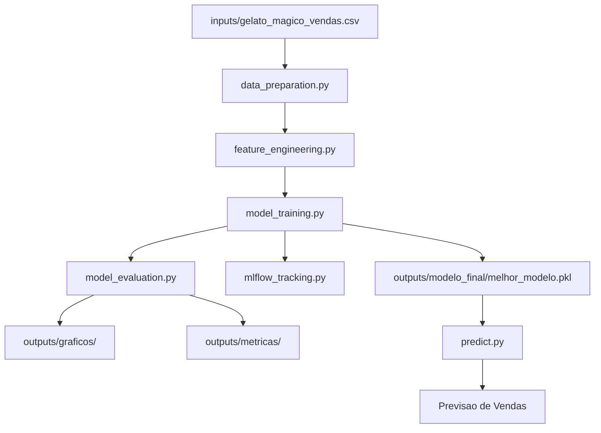
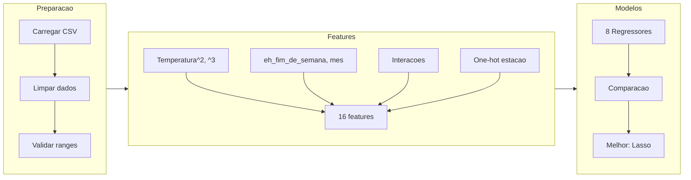
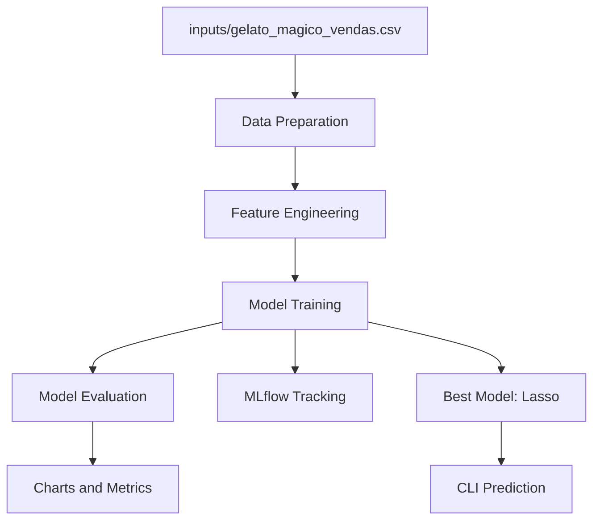

<div align="center">

# Gelato Magico - Previsao de Vendas com Machine Learning


Projeto de Machine Learning para previsao de vendas diarias de sorveteria com 8 modelos de regressao, MLflow e documentacao Azure ML

[Portugues](#portugues) | [English](#english)

</div>

---

<a name="portugues"></a>

## Sobre

Projeto desenvolvido no bootcamp **Microsoft Certification Challenge #5 - DP-100** da [DIO](https://www.dio.me/), implementando um pipeline completo de Machine Learning para prever vendas diarias da sorveteria ficticia "Gelato Magico" em Sao Paulo. O sistema compara 8 modelos de regressao (Linear, Ridge, Lasso, Random Forest, Gradient Boosting, SVR, Polinomial grau 2 e 3), utiliza engenharia de features para derivar 16 variaveis a partir de 5 originais, integra MLflow para rastreamento de experimentos, e documenta como o fluxo seria implementado no Azure Machine Learning Studio seguindo os conceitos do exame DP-100.

## Tecnologias

| Categoria | Tecnologia |
|-----------|-----------|
| **Linguagem** | Python 3.12 |
| **ML** | scikit-learn, MLflow |
| **Dados** | Pandas, NumPy |
| **Visualizacao** | Matplotlib, Seaborn |
| **Cloud** | Azure Machine Learning (documentacao teorica) |
| **Containerizacao** | Docker |
| **Bootcamp** | DIO - Microsoft DP-100 |

## Arquitetura



### Pipeline de Dados



## Resultados

| Rank | Modelo | MAE (R$) | RMSE (R$) | R2 | MAPE |
|------|--------|----------|-----------|-----|------|
| 1 | **Lasso** | **23.53** | **31.02** | **0.888** | **5.56%** |
| 2 | Ridge | 23.85 | 31.26 | 0.886 | 5.61% |
| 3 | Regressao Linear | 24.69 | 32.47 | 0.877 | 5.82% |
| 4 | SVR | 27.74 | 36.08 | 0.848 | 6.51% |
| 5 | Gradient Boosting | 28.89 | 38.30 | 0.829 | 6.78% |
| 6 | Random Forest | 29.12 | 38.84 | 0.824 | 6.84% |
| 7 | Polinomial Grau 2 | 41.73 | 67.63 | 0.466 | 9.34% |
| 8 | Polinomial Grau 3 | 57.48 | 111.39 | -0.448 | 12.79% |

O modelo Lasso apresentou o melhor desempenho com erro medio de R$23.53 por dia e MAPE de 5.56%, explicando 88.8% da variancia das vendas.

## Estrutura do Projeto

```
ml-sales-prediction-azure/
├── inputs/
│   ├── ice_cream_sales_original.csv    # Dataset base (~500 registros)
│   ├── gelato_magico_vendas.csv        # Dataset sintetico (365 registros)
│   └── descricao_dados.txt
├── outputs/
│   ├── graficos/                       # 35 graficos de analise
│   ├── metricas/                       # CSVs comparativos
│   └── modelo_final/
│       └── melhor_modelo.pkl           # Modelo Lasso serializado
├── src/
│   ├── __init__.py
│   ├── generate_dataset.py             # Geracao dos datasets
│   ├── data_preparation.py             # Carga, limpeza, EDA
│   ├── feature_engineering.py          # 16 features derivadas
│   ├── model_training.py              # Treinamento de 8 modelos
│   ├── model_evaluation.py            # Avaliacao e visualizacoes
│   ├── pipeline.py                    # Pipeline sklearn end-to-end
│   ├── predict.py                     # Inferencia via CLI
│   └── mlflow_tracking.py            # Integracao MLflow
├── notebooks/
│   └── exploratory_analysis.ipynb
├── Dockerfile
├── requirements.txt
├── LICENSE
└── README.md
```

## Inicio Rapido

### Pre-requisitos

- Python 3.10+
- pip

### Instalacao

```bash
git clone https://github.com/galafis/ml-sales-prediction-azure.git
cd ml-sales-prediction-azure
pip install -r requirements.txt
```

### Execucao

```bash
# Gerar datasets
python -m src.generate_dataset

# Analise exploratoria
python -m src.data_preparation

# Engenharia de features
python -m src.feature_engineering

# Treinar modelos
python -m src.model_training

# Avaliar modelos
python -m src.model_evaluation

# Rastreamento MLflow (opcional)
python -m src.mlflow_tracking

# Previsao
python -m src.predict --temperatura 30 --dia_da_semana 6 --feriado --estacao verao
```

## Docker

```bash
docker build -t ml-sales-prediction .
docker run ml-sales-prediction
```

## Testes

```bash
pytest tests/ -v
```

## Aprendizados

- Comparacao sistematica de 8 modelos de regressao com metricas padronizadas
- Engenharia de features transformando 5 colunas originais em 16 variaveis preditoras
- Rastreamento de experimentos com MLflow (parametros, metricas e artefatos)
- Compreensao dos conceitos DP-100: AutoML, Designer, SDK v2, Model Registry e endpoints gerenciados
- Analise de overfitting (Polinomial grau 3 com R2 negativo) e regularizacao (Lasso/Ridge)
- Validacao cruzada e curvas de aprendizado para avaliacao robusta de modelos

## Autor

**Gabriel Demetrios Lafis**

- GitHub: [@galafis](https://github.com/galafis)
- LinkedIn: [Gabriel Demetrios Lafis](https://www.linkedin.com/in/gabriel-demetrios-lafis/)

## Licenca

Este projeto esta licenciado sob a [Licenca MIT](LICENSE).

---

<a name="english"></a>

## About

Project developed in the **Microsoft Certification Challenge #5 - DP-100** bootcamp by [DIO](https://www.dio.me/), implementing a complete Machine Learning pipeline to predict daily sales for the fictional ice cream shop "Gelato Magico" in Sao Paulo. The system compares 8 regression models (Linear, Ridge, Lasso, Random Forest, Gradient Boosting, SVR, Polynomial degree 2 and 3), uses feature engineering to derive 16 variables from 5 original columns, integrates MLflow for experiment tracking, and documents how the workflow would be implemented in Azure Machine Learning Studio following DP-100 exam concepts.

## Technologies

| Category | Technology |
|----------|-----------|
| **Language** | Python 3.12 |
| **ML** | scikit-learn, MLflow |
| **Data** | Pandas, NumPy |
| **Visualization** | Matplotlib, Seaborn |
| **Cloud** | Azure Machine Learning (theoretical documentation) |
| **Containerization** | Docker |
| **Bootcamp** | DIO - Microsoft DP-100 |

## Architecture



## Results

| Rank | Model | MAE (R$) | R2 | MAPE |
|------|-------|----------|-----|------|
| 1 | **Lasso** | **23.53** | **0.888** | **5.56%** |
| 2 | Ridge | 23.85 | 0.886 | 5.61% |
| 3 | Linear Regression | 24.69 | 0.877 | 5.82% |

The Lasso model achieved the best performance with an average error of R$23.53 per day and MAPE of 5.56%, explaining 88.8% of sales variance.

## Quick Start

### Prerequisites

- Python 3.10+
- pip

### Installation

```bash
git clone https://github.com/galafis/ml-sales-prediction-azure.git
cd ml-sales-prediction-azure
pip install -r requirements.txt
```

### Running

```bash
python -m src.generate_dataset
python -m src.model_training
python -m src.predict --temperatura 30 --dia_da_semana 6 --feriado --estacao verao
```

## Docker

```bash
docker build -t ml-sales-prediction .
docker run ml-sales-prediction
```

## Tests

```bash
pytest tests/ -v
```

## Learnings

- Systematic comparison of 8 regression models with standardized metrics
- Feature engineering transforming 5 original columns into 16 predictor variables
- Experiment tracking with MLflow (parameters, metrics, and artifacts)
- Understanding DP-100 concepts: AutoML, Designer, SDK v2, Model Registry, and managed endpoints
- Overfitting analysis (Polynomial degree 3 with negative R2) and regularization (Lasso/Ridge)
- Cross-validation and learning curves for robust model evaluation

## Author

**Gabriel Demetrios Lafis**

- GitHub: [@galafis](https://github.com/galafis)
- LinkedIn: [Gabriel Demetrios Lafis](https://www.linkedin.com/in/gabriel-demetrios-lafis/)

## License

This project is licensed under the [MIT License](LICENSE).
